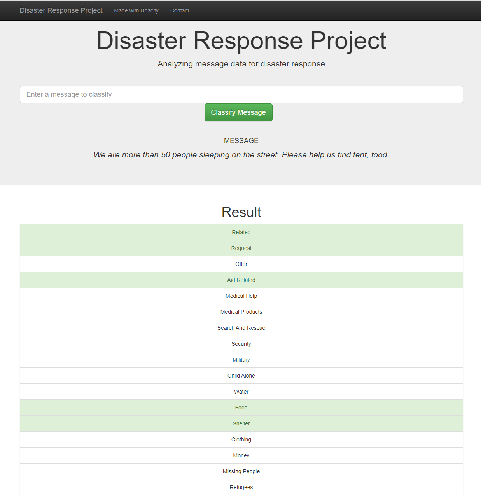

# Disaster Response Pipeline Project

A web and backend application where an emergency worker can input a message and get classification results in several categories. There are 36 different categories related to disaster response. A sample of those categories are 'aid_related', 'medical_help', 'medical_products', 'search_and_rescue', 'security', 'military', 'child_alone', 'water', 'food', 'shelter', 'clothing', 'money', 'missing_people' and etc. By classifying these messages, we can allow these messages to be sent to the appropriate disaster relief agency.

### Table of Contents

1. [Installation](#installation)
2. [Project Description](#description)
3. [File Descriptions](#files)
4. [Instructions](#instructions)
5. [Disaster Response Project Web Application](#web)
6. [Licensing, Authors, and Acknowledgements](#licensing)

## Installation 

In addition to default sets of libraries installed by the Anaconda distribution of Python 3.7 (which are needed for this application: NumPy, Pandas and Scikit-learn, regex, sqlalchemy, flask, plotly), the application also requires these libraries to be installed: pickle, nltk. 

## Project Description

This is the repo of building a Disaster Response Pipeline project for the Udacity Data Scientist Nanodegree.
For this project, we build a web and backend application which consists of:

1. **A web application** is built using the Flask framework. This is where an emergency worker can input a message and get classification results in several categories. There are 36 different categories related to disaster response. The web application will also display visualizations of the three different data sets

2. **A backend application** which consist of: 

- **an ETL pipeline** which will pre-process and cleanse the raw messages provided by **Figure Eight**. These message data are loaded  into the SQLlite Database after cleansing.

- **a text processing and machine learning pipeline** is built with natural language toolkits (nltk) and ML pipeline. Then, the model is trained and tuned using GridSearchCV.
        - 
   

## File Descriptions 

## Instructions 

1. Run the following commands in the project's root directory to set up your database and model.

    - To run ETL pipeline that cleans data and stores in database
        `python data/process_data.py data/disaster_messages.csv data/disaster_categories.csv data/DisasterResponse.db`
    - To run ML pipeline that trains classifier and saves
        `python models/train_classifier.py data/DisasterResponse.db models/classifier.pkl`

2. Run the following command in the app's directory to run your web app.
    `python run.py`

3. Go to http://0.0.0.0:3001/

## Disaster Response Project Web Application screenshot

## Licensing, Authors, Acknowledgements

Must give credit to **Figure Eight** for providing the labeled messages datasets. The message datasets are also included in this repository as two csv files: disaster_categories.csv and disaster_messages.csv  Otherwise, feel free to use the code here as you would like!
