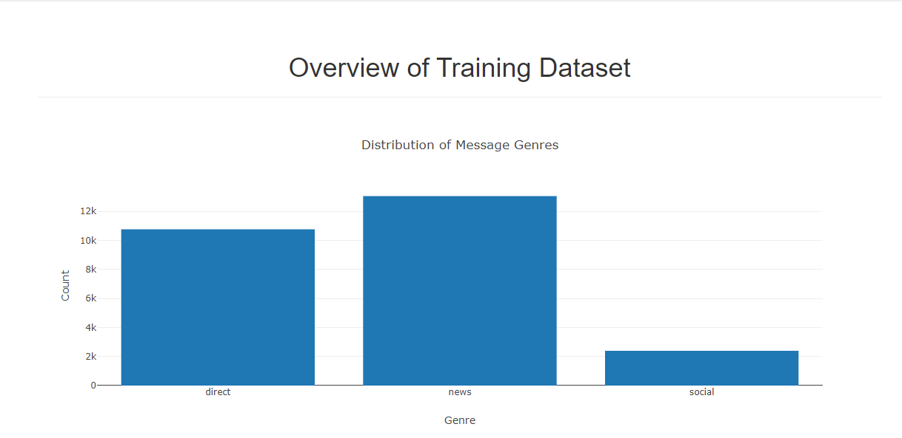
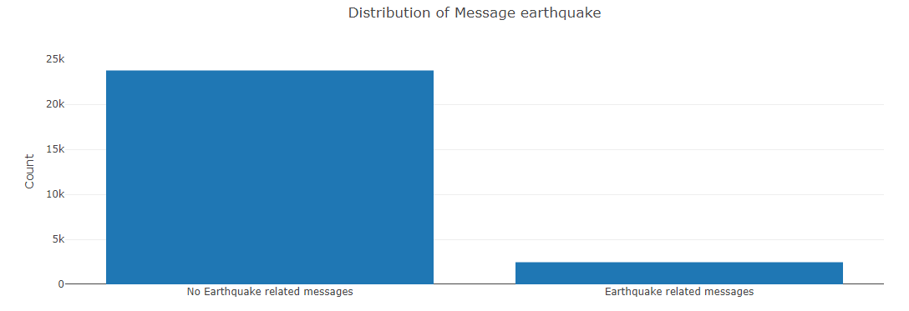
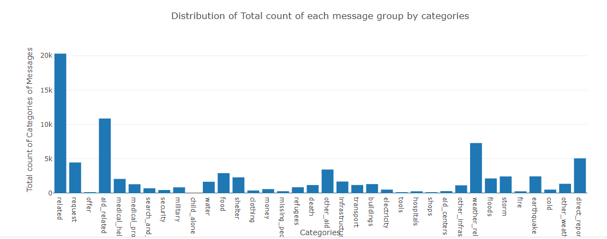

# Disaster Response Pipeline Project

A web and backend application where an emergency worker can input a message and get classification results in several categories. There are 36 different categories related to disaster response. A sample of those categories are 'aid_related', 'medical_help', 'medical_products', 'search_and_rescue', 'security', 'military', 'child_alone', 'water', 'food', 'shelter', 'clothing', 'money', 'missing_people' and etc. By classifying these messages, we can allow these messages to be sent to the appropriate disaster relief agency.

### Table of Contents

1. [Installation](#installation)
2. [Project Description](#description)
3. [File Descriptions](#files)
4. [Instructions](#instructions)
5. [Disaster Response Project Web Application](#web)
6. [Licensing, Authors, and Acknowledgements](#licensing)

## Installation `    `

In addition to default sets of libraries installed by the Anaconda distribution of Python 3.7 (which are needed for this application: NumPy, Pandas, Scikit-learn, regex, sqlalchemy, flask and plotly), the application also requires these libraries to be installed: pickle, nltk. 

## Project Description

This is the repo of building a Disaster Response Pipeline project for the Udacity Data Scientist Nanodegree.
For this project, we build a web and backend application which consists of:

1. **A web application** is built using the Flask framework. This is where an emergency worker can input a message and get classification results in several categories. There are 36 different categories related to disaster response. The web application will also display visualizations of the three different data sets

2. **A backend application** which consist of: 

- **an ETL pipeline** which will pre-process and cleanse the raw messages provided by **Figure Eight**. These message data are loaded  into the SQLlite Database after cleansing.

- **a text processing and machine learning pipeline** is built with natural language toolkits (nltk) and ML pipeline. Then, the model is trained and tuned using GridSearchCV.
        

## File Descriptions 

1. At the **top level folder (Disaster-Response-Pipeline)**, there are:

- **README.md** file (which provides the detailed information on how to build and run this project), four png files are used to embed the web application image and other three visual plots's images into the README.md file.

- **ETL Pipeline Preparation.ipynb** is an IPython notebook which is used to create, explore and test the ETL pipeline. Then, this IPython notebook is transferred to **process_data.py** in the data folder. This IPython notebook does not require to build the final application.

- **ML Pipeline Preparation.ipynb** is an IPython notebook which is used to build, explore and evaluate ML models and the ML pipelines. It uses GridSearch to find the optimum model. Then, this code is transferred to **train_classifier.py** in the model folder. This IPython notebook does not require to build the final application.

2. **App subfolder** includes 

- **templates folder** which includes: **master.html** (home page of the web app) and **go.html** (output page of the web app which shows classification results associated with the input message)

- **run.py** is the web application built on top of Flask framework. This framework is used to link the query from the frontend to the backend ML model. The output of the classification predictions from the ML model are displayed using plotly. Plotly is also used to display the visualizations of the three different data sets 

3. **Data subfolder** includes

- **disaster_messages.csv** (are disaster response's raw messages ) and **disaster_categories.csv** (are disaster response's categories messages)

- **DisasterResponse.db** is the database which store the messages after pre-processed and cleansed. 

- **process_data.py** is the python code which merged 2 datasets from the raw messages into the Data Frames. It converts the categories of disaster messages into 36 individual category columns. It drops duplicate messages and then stores these cleansed messages into SQLite Database.

4. **Model subfolder** includes **train_classifier.py**. This python code loads the messages from the SQLlite Database. It builds ML pipeline to train the ML model for classifying the disaster messages using these cleansed message data. It uses Gridsearch to find the optimum model. One of the ML pipeline component applying natural language toolkit to split text messages into words, to convert the words to lowercase and then to return it to the root form of the words before converting these words into feature sets.

## Instructions 

1. Run the following commands in the project's root directory to set up your database and model.

    - To run ETL pipeline that cleans data and stores in database
        `python data/process_data.py data/disaster_messages.csv data/disaster_categories.csv data/DisasterResponse.db`
    - To run ML pipeline that trains classifier and saves
        `python models/train_classifier.py data/DisasterResponse.db models/classifier.pkl`

2. Run the following command in the app's directory to run your web app.
    `python run.py`

3. Go to http://0.0.0.0:3001/

## Disaster Response Project Web Application screenshots

## Licensing, Authors, Acknowledgements

Must give credit to **Figure Eight** for providing the labeled messages datasets. The message datasets are also included in this repository as two csv files: disaster_categories.csv and disaster_messages.csv. Please feel free to use the code here as you would like!
